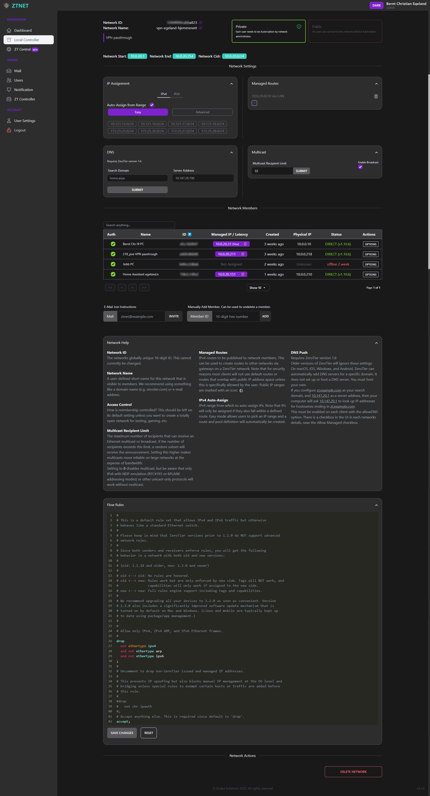
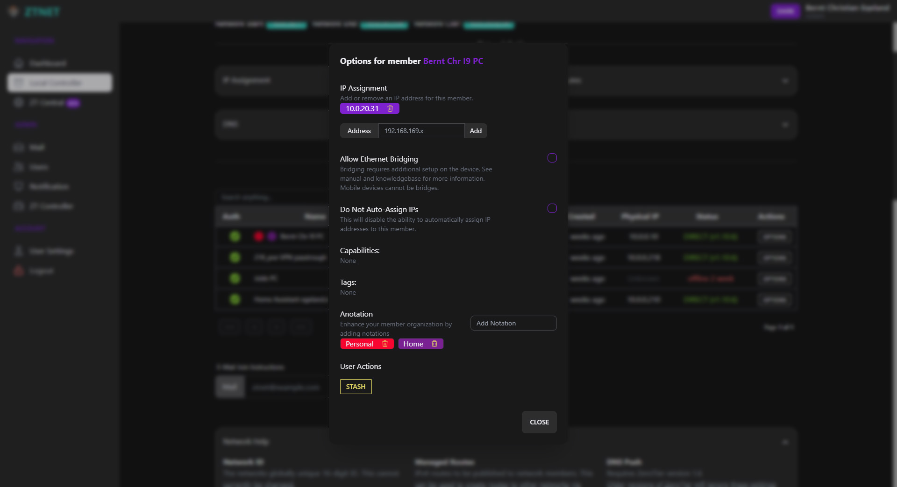
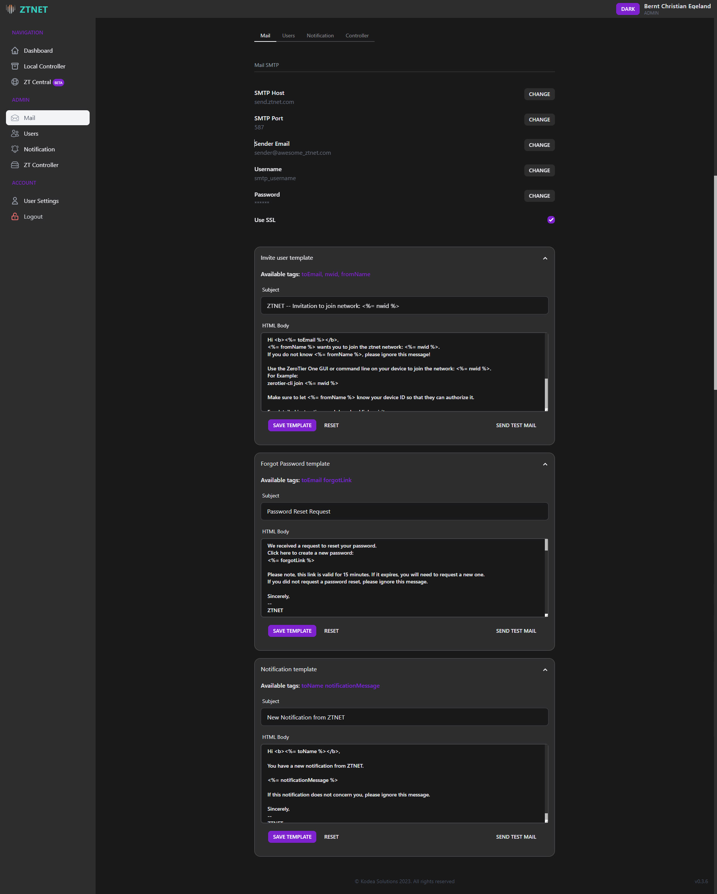
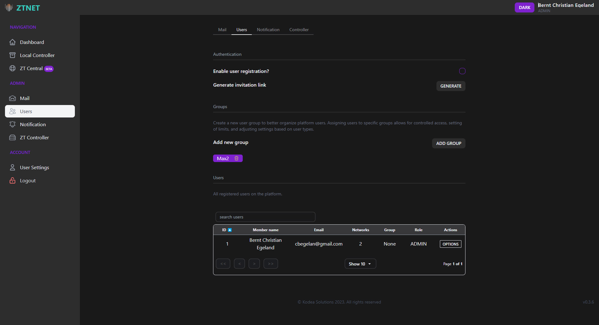
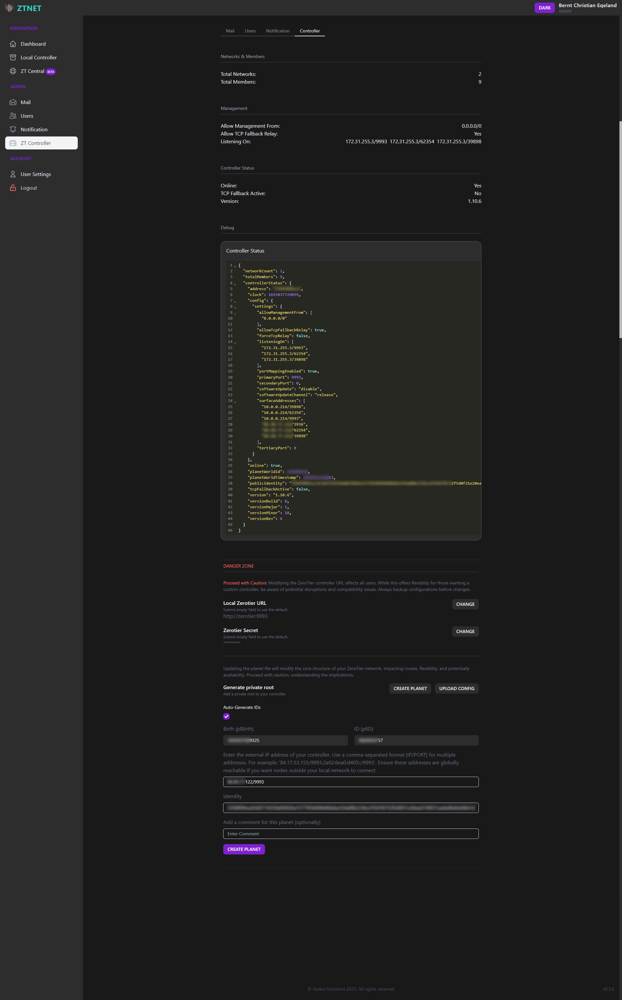
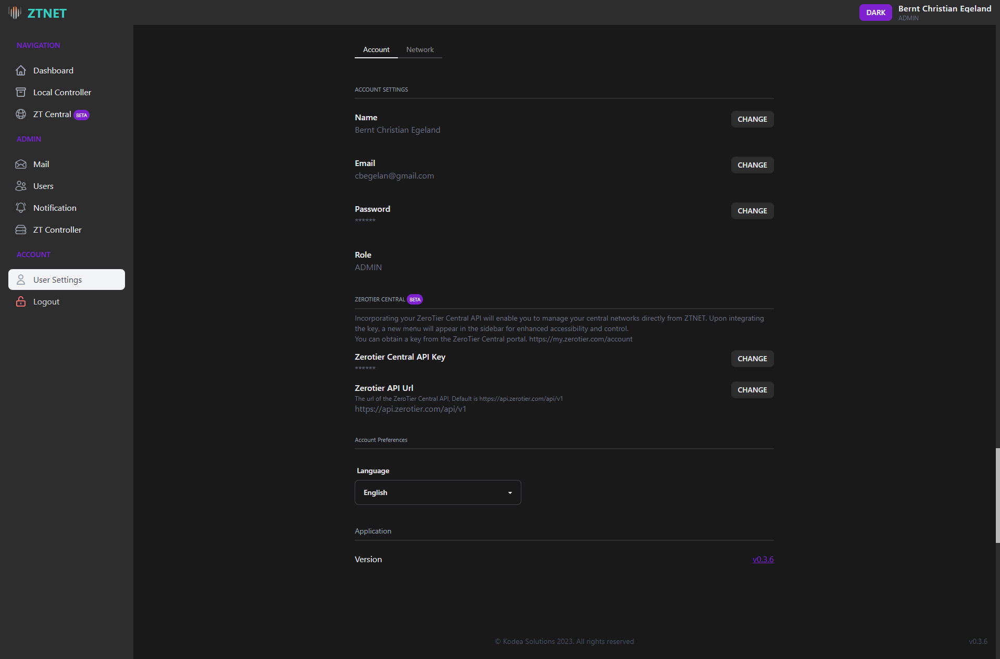

<br />
<p align="center">
  <a href="https://github.com/sinamics/ztnet">
    
  </a>

  <p align="center">
    ZTNET - Self-Hosted ZeroTier network controller.
    <br />
    <br />
    <a href="https://github.com/sinamics/ztnet/issues/new?assignees=&labels=support%2Ctriage&projects=&template=general_support_request.yml&title=%5BSupport%5D%3A+">Bug Report</a>
    ·
    <a href="https://github.com/sinamics/ztnet/issues/new?assignees=&labels=enhancement&projects=&template=feature_request.yml&title=%5BFeature+Request%5D%3A+">Feature Request</a>
    ·
    <a href="https://github.com/sinamics/ztnet/discussions">Ask a Question</a>
  </p>
  <p align="center">
    <a href="https://ztnet.network">Documentation</a>
    <br />
  </p>
  <div align="center">

  [](https://github.com/sinamics/ztnet/actions)
  [](https://github.com/sinamics/ztnet/releases/latest)
  [](https://hub.docker.com/r/sinamics/ztnet/)

  </div>
</p>
<br />

ZTNET - Zerotier Controller Web UI, is a robust and versatile ZeroTier controller application designed to ease the management of ZeroTier networks. Crafted with state-of-the-art technologies like T3-Stack with Next.js, Prisma, tRPC, TypeScript, Tailwind CSS, and DaisyUI, it streamlines the process of creating, updating, and overseeing your ZeroTier networks.

With a rich palette of features, and an intuitive user interface, ZTNET embodies a paradigm shift in network management experience. It elegantly handles the complexity, letting you focus on what you do best.


<details open="open" >
<summary>Table of Contents</summary>

- [Overview](#next-ztnet)
- [🔥 Features](#-features)
- [⚙️ Installations](#%EF%B8%8F-installations)
  - [Using Docker Compose](#using-docker-compose)
  - [Note: First user to register will automatically be assigned as admin.](#%EF%B8%8F-important-the-first-registered-user-automatically-gains-admin-privileges)
  - [Environment Variables](#environment-variables)
- [👨‍💻 Development](#development)
  - [VSCode Container Development (Recommended)](#vscode-container-development-recommended)
  - [The Traditional Way](#the-traditional-way)
    - [Setup Environment Variables](#setup-environment-variables)
- [📷 Pictures](#network-page-layout)
- [⚠️ Disclaimer](#%EF%B8%8F-disclaimer)

</details>

<table>
<tr>
<td>
<h2> 🔥 Top Features </h2>

🍬 **ZeroTier Central API Support**  
ZTNET integrates seamlessly with the ZeroTier Central, allowing for enhanced management and configuration capabilities directly from our interface.

🌐 **Custom Root: Craft Your Private World**  
With ZTNET, set up your own private root server and create an isolated network world, offering both privacy and enhanced control in your ZeroTier journey.

🛰️ **6plane and rfc4193 IPv6 Support**   
ZTNET now supports both 6plane and rfc4193 IPv6, enhancing your networking capabilities.

🚀 **Personalized User Spaces & Networks**  
Every user in ZTNET enjoys their individual space, granting them the autonomy to create and manage personal networks. It's not just about connecting; it's about personalizing your connectivity.

🌍 **Multi-Language**  
The app supports English, Spanish (ES), Norwegian (NO), and Chinese (ZH) languages for user convenience and inclusivity.

🛠️ **Multi-Architecture**  
Designed for versatility, ZTNET supports multiple architectures - ARM64 and AMD64. This ensures compatibility across a wide range of devices and systems.

📧 **Email Invitations**  
Easily invite members to your network with the integrated email feature.

</td>
</tr>
</table>

## ⚙️ Installations

### Using Docker Compose

Skip the hassle of cloning the repository. Simply create a `docker-compose.yml` file on your machine and populate it as follows:

```yaml
version: "3.1"
services:
  postgres:
    image: postgres:15.2-alpine
    container_name: postgres
    restart: unless-stopped
    environment:
      POSTGRES_USER: postgres
      POSTGRES_PASSWORD: postgres
      POSTGRES_DB: ztnet
    volumes:
      - postgres-data:/var/lib/postgresql/data
    networks:
      - app-network

  zerotier:
    image: zyclonite/zerotier:1.10.6
    hostname: zerotier
    container_name: zerotier
    restart: unless-stopped
    volumes:
      - zerotier:/var/lib/zerotier-one
    cap_add:
      - NET_ADMIN
      - SYS_ADMIN
    devices:
      - /dev/net/tun:/dev/net/tun
    networks:
      - app-network
    ports:
      - "9993:9993/udp"
    environment:
      - ZT_OVERRIDE_LOCAL_CONF=true
      - ZT_ALLOW_MANAGEMENT_FROM=172.31.255.0/29

  ztnet:
    image: sinamics/ztnet:latest
    container_name: ztnet
    working_dir: /app
    volumes:
      - zerotier:/var/lib/zerotier-one
    restart: unless-stopped
    ports:
      - 3000:3000
    environment:
      POSTGRES_HOST: postgres
      POSTGRES_PORT: 5432
      POSTGRES_USER: postgres
      POSTGRES_PASSWORD: postgres
      POSTGRES_DB: ztnet
      NEXTAUTH_URL: "http://localhost:3000"
      NEXTAUTH_SECRET: "random_secret"
    networks:
      - app-network
    links:
      - postgres
    depends_on:
      - postgres
      - zerotier
volumes:
  zerotier:
  postgres-data:

networks:
  app-network:
    driver: bridge
    ipam:
      driver: default
      config:
        - subnet: 172.31.255.0/29
```

To launch ZTNET, execute the following command in your `docker-compose.yml` directory:

`docker-compose up -d`

This action pulls necessary images, initializes the containers, and activates the services.
Visit `http://localhost:3000` to access the ZTNET web interface.

### ⚠️ Important: The first registered user automatically gains admin privileges.

As an administrator, you possess unique capabilities not available to regular users. This includes the ability to view all registered accounts on the controller.

Please note that while admins have visibility over registered accounts, they **cannot** interact with or modify other users' networks directly. Each network's configuration and data remain exclusive to the respective user account, maintaining privacy and security for all users.

### Environment Variables

The `docker-compose.yml` file includes several environment variables that you can customize based on your needs. Here is a description of each variable:

- `POSTGRES_HOST`: The hostname of the PostgreSQL service.
- `POSTGRES_PORT`: The port number for the PostgreSQL service.
- `POSTGRES_USER`: The username for the PostgreSQL database.
- `POSTGRES_PASSWORD`: The password for the PostgreSQL database user.
- `POSTGRES_DB`: The name of the PostgreSQL database.
- `NEXTAUTH_URL`: The URL for NextAuth authentication.
- `NEXTAUTH_SECRET`: The secret key for NextAuth authentication.

These are system environment variables used by the ZeroTier service and should not be changed:

- `ZT_OVERRIDE_LOCAL_CONF`: Allows overriding local ZeroTier configuration.
- `ZT_ALLOW_MANAGEMENT_FROM`: Defines the IP range allowed to access the ZeroTier management interface.
- `ZT_ADDR`: The address of the ZeroTier service.

To change any of these values, update the corresponding environment variable in the `docker-compose.yml` file.

# 🛠️Development

This project welcomes contributions. To ensure smooth collaboration, please follow the steps below:

1. Before submitting a PR, make sure to run the linter and tests to check for any errors. You can do this by running the following commands in your terminal:
   `npm run lint` and `npm run test`

## vscode container development (recommended)

1. Install [Visual Studio Code](https://code.visualstudio.com/) and the [Remote Development Extension Pack](https://marketplace.visualstudio.com/items?itemName=ms-vscode-remote.vscode-remote-extensionpack).
2. Clone this repository.
3. Open the repository in Visual Studio Code.
4. Select **Remote-Containers: Open Folder in Container...** from the Command Palette (<kbd>F1</kbd>).
5. Select **Reopen in Container** when prompted.
6. Once the container is running, hit (<kbd>F1</kbd>) and type Task to open the task menu.
7. Select **Install dependencies packages** to install all the dependencies.
8. Select **Start Development Server** to start the development server.
9. Open browser and go to `http://localhost:3000`.

**NOTE:** Hot reloading on Windows may not be as performant as on other operating systems. If you encounter sluggish hot reloading, consider setting the environment variable WATCHPACK_POLLING=true. However, for optimal performance, we strongly suggest utilizing the **Windows Subsystem for Linux (WSL)** to develop your application. This approach will provide a swift and seamless hot reload experience, allowing you to focus on coding rather than waiting for the application to reload.

## 📷 Images
View the following images for a visual overview of the ZTNet application:
<details>
<summary>Network Page</summary>



</summary>
</details>

<details>
<summary>Network Member Options</summary>



</summary>
</details>

<details>
<summary>Mail Settings</summary>



</summary>
</details>

<details>
<summary>Platform Users</summary>



</summary>
</details>

<details>
<summary>Controller</summary>



</summary>
</details>

<details>
<summary>User Profile</summary>



</summary>
</details>

## ⚠️ Disclaimer:

Please note that while this application aims to make managing ZeroTier networks easier, it is provided "as is" without any warranties or guarantees of any kind. As the user, you assume all responsibility for its use. Always ensure you have adequate backups and understanding of any changes you make to your network configurations. This includes understanding that the first registered user will be granted administrative privileges.

## 📄 Attribution and Licensing Notice for Third-Party Components
This project utilizes the **mkworld** tool, written in Go, to generate the custom planet file. While the original mkworld tool was developed by ZeroTier, the version we are using was adapted and re-implemented in Go by Patrick Young (@kmahyyg). This Go adaptation is licensed under the GNU General Public License v3.0. We would like to express our appreciation to Patrick Young (@kmahyyg) for his efforts in creating this Go version, which has benefited our project.

Our project, in its entirety, is also licensed under the GNU General Public License v3.0. For a comprehensive understanding of our project's licensing terms, please consult our LICENSE file.
