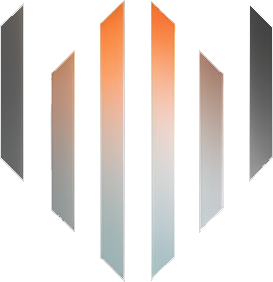

 

  

  

    ZTNET - Self-Hosted ZeroTier network controller.
     
     
    <a href="https://github.com/sinamics/ztnet/issues/new?assignees=&labels=bug&projects=&template=bug_template.yml&title=%5BBug%5D%3A+">Bug Report</a>
    ·
    <a href="https://github.com/sinamics/ztnet/issues/new?assignees=&labels=enhancement&projects=&template=feature_request.yml&title=%5BFeature+Request%5D%3A+">Feature Request</a>
    ·
    <a href="https://github.com/sinamics/ztnet/discussions">Ask a Question</a>
  

  <h3 align="center">
    <a href="https://ztnet.network">Documentation</a>
    ·
    <a href="https://discord.gg/VafvyXvY58">Join our Discord</a>
     
  </h3>
  

  
  
  

  

 

ZTNET - ZeroTier Controller Web UI is a robust and versatile application designed to transform the management of ZeroTier networks. Now featuring **organization** and **multi-user** support, it elevates the network management experience, accommodating team-based environments and larger organizations seamlessly.

With a rich palette of features, and an intuitive user interface, ZTNET embodies a paradigm shift in network management experience. It elegantly handles the complexity, letting you focus on what you do best.

### [See Installation Instruction](https://ztnet.network/installation/docker-compose)

## 📷 Images
View the following images for a visual overview of the ZTNet application:

Organization Page

Network Page

Network Member Options

Mail Settings

Platform Users

Controller

User Profile

## ⚠️ Disclaimer:

Please note that while this application aims to make managing ZeroTier networks easier, it is provided "as is" without any warranties or guarantees of any kind. As the user, you assume all responsibility for its use. Always ensure you have adequate backups and understanding of any changes you make to your network configurations. This includes understanding that the first registered user will be granted administrative privileges.
<!-- 
## 📄 Attribution and Licensing Notice for Third-Party Components
This project utilizes the **mkworld** tool, written in Go, to generate the custom planet file. While the original mkworld tool was developed by ZeroTier, the version we are using was adapted and re-implemented in Go by Patrick Young (@kmahyyg). This Go adaptation is licensed under the GNU General Public License v3.0. We would like to express our appreciation to Patrick Young (@kmahyyg) for his efforts in creating this Go version, which has benefited our project.

Our project, in its entirety, is also licensed under the GNU General Public License v3.0. For a comprehensive understanding of our project's licensing terms, please consult our LICENSE file. -->
