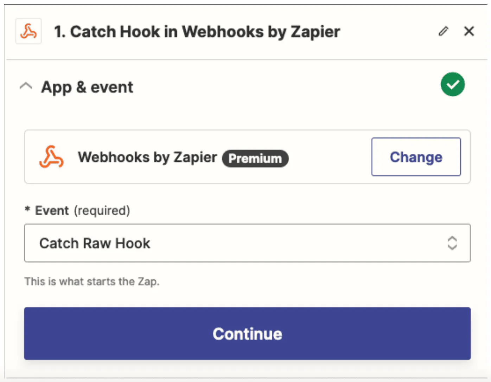
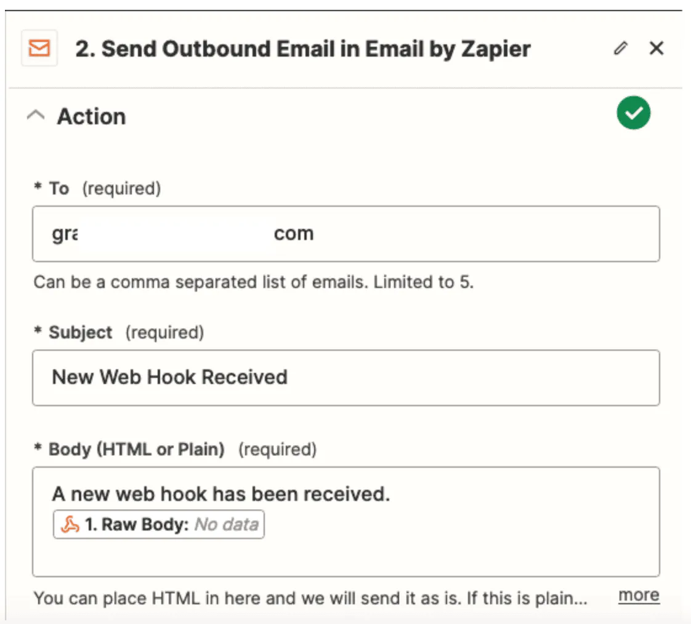

# Configuring Webhooks in ZTNET

Webhooks in ZTNET empower your organization with real-time event notifications. To set up a webhook, you'll need to specify:

- **Webhook Name**: Assign a unique and descriptive name to each webhook.
- **Webhook Actions**: Choose the [events](#network-events) that should trigger notifications. Multiple selections are allowed.
- **Endpoint URL (HTTPS)**: This is the receiver URL where ZTNET will send event data. It must be a publicly accessible HTTPS URL to ensure security.


## Data Structure

Each webhook event in ZTNET includes a JSON payload sent to the configured endpoint URL. Here are examples of the JSON content for several webhook types:

## Member Configuration Changed (`MEMBER_CONFIG_CHANGED`)

When a member's configuration changes, the webhook will contain the following data:

```json
{
  // HookType is the type of hook being fired.
  "hookType": "MEMBER_CONFIG_CHANGED",
  // organizationId is the internal ID the hook belongs to
  "organizationId": "org_123456",
  // NetworkID is the network the member belongs to
  "networkId": "network_12345",
  // MemberID is the network member that was changed
  "memberId": "mem_112233",
  // UserID is the ID of the user that modified the network member
  "userId": "user_445566",
  // UserEmail is the email address of the user that modified the network member
  "userEmail": "user@example.com",
  // Changes is a map of the changes that were made to the network member
  "changes": {
    "authorized": true,
  }
}
```

### Network Created (NETWORK_CREATED)
After a new network is created, the webhook payload will contain the following data:
```json
{
  "hookType": "NETWORK_CREATED",
  "organizationId": "org_123456",
  "networkId": "net_78910",
  "userId": "user_445566",
  "userEmail": "user@example.com"
}
```

## Webhook Events

Webhooks in ZTNET allow you to set up automated notifications for specific events within your networks and organization. Below you'll find the available webhook events and their descriptions:

## Network Events

- **Network Join (`NETWORK_JOIN`)**  
  Fired when a new member requests to join a network. This event is triggered once when the network controller receives the join request from the member.

- **Network Created (`NETWORK_CREATED`)**  
  Fired when a network is created within the organization.

- **Network Configuration Changed (`NETWORK_CONFIG_CHANGED`)**  
  Fired when there is a change in the organization network's configuration settings.

- **Network Deleted (`NETWORK_DELETED`)**  
  Fired when a network is permanently deleted from the organization.

## Member Events

- **Member Configuration Changed (`MEMBER_CONFIG_CHANGED`)**  
  Triggered when a member's configuration in a organization network is altered.

- **Member Deleted (`MEMBER_DELETED`)**  
  Fired when a member is removed from a organization network.

## Organization Events

- **Organization Member Removed (`ORG_MEMBER_REMOVED`)**  
  Fired when a member is removed from the organization, whether by an administrator or by the member themselves.


## Example of Webhook Receiver

To experiment with webhooks or for development purposes, you can use services like [Zapier](https://zapier.com/) to quickly establish a webhook receiver. For instance, to receive an email for each new member request:

1. Set up a "Webhooks by Zapier" trigger, and choose the "Catch Raw Hook" event to capture the raw POST data from ZTNET.


2. Add an "Send Outbound Email" action in Zapier, fill in your email address, and attach the raw POST data as the email content.


3. Copy the webhook URL generated by Zapier.
4. Go to your ZTNET organization's settings, create a new webhook receiver using the copied URL in the `Endpoint URL` field, and select the "NETWORK_JOIN" event type.
5. Enable your webhook in ZTNET and activate your Zapier workflow.

Now, whenever a new member tries to join your network in ZTNET, you'll receive an email notification through Zapier.
